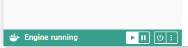
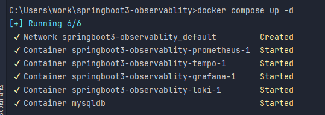
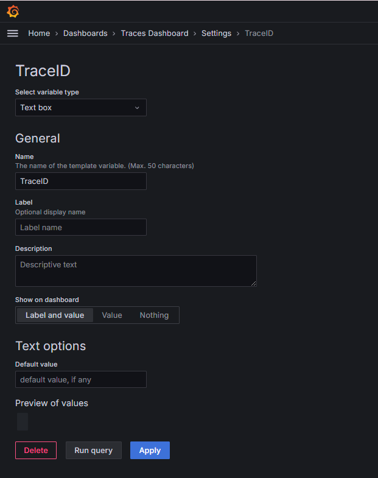

# Implementing Observability with Grafana Stack
For original source code visit [SaiUpadhyayula's GitHub Repository](https://github.com/SaiUpadhyayula/springboot3-observablity) 

> [!NOTE]
> This project was repurposed for the use of [**Studio Galilei**'s](https://www.studiog.kr/) 
> research and development division (Create G).
 
Last Modified (2024-08-07)


## Basic overview of tools used
- Grafana Loki: database for Logs (LOGQL)
- Prometheus: database for Metrics (PROMQL)
- Grafana Tempo: database for Traces (TRACEQL)
- Grafana: dashboard to view all the information


## Set Up
This set up is specific to **Maven** environment, for Gradle double-check the dependencies. For the container **Docker** is used
for production level Kubernetes is preferred.

### Dependencies
> [!IMPORTANT] 
> Add the following dependencies to the `pom.xml` file for each service.

**Loki dependency** 
```
<dependency>
    <groupId>com.github.loki4j</groupId>
    <artifactId>loki-logback-appender</artifactId>
    <version>1.5.2</version>
</dependency>
```
check this library for the latest version: [Maven Repository](https://mvnrepository.com/artifact/com.github.loki4j/loki-logback-appender)

**Prometheus dependency**

*Micrometer Prometheus*
```
<dependency>
 <groupId>io.micrometer</groupId>
 <artifactId>micrometer-registry-prometheus</artifactId>
 <scope>runtime</scope>
</dependency>
```

*Spring Actuator: SpringBoot Actuator exposes operational information about the running application.*
```
<dependency>
 <groupId>org.springframework.boot</groupId>
 <artifactId>spring-boot-starter-actuator</artifactId>
</dependency>
```

**Tempo dependency**

*Micrometer Tracing*
```
<dependency>
 <groupId>io.micrometer</groupId>
 <artifactId>micrometer-tracing-bridge-brave</artifactId>
</dependency>

<dependency>
 <groupId>io.zipkin.reporter2</groupId>
 <artifactId>zipkin-reporter-brave</artifactId>
</dependency>
```
`micrometer-tracing-bridge-brave` automatically adds the traceID for the distributed tracing. `zipkin-reporter-brave`
exports the tracing information to tempo.
>[!NOTE]
> `Opentelemetry-micrometer-tracing-bridge-otel` can be used in place of the `zipkin-reporter-brave`

To trace calls to the database, add the following dependency
```
<dependency>
    <groupId>net.ttddyy.observation</groupId>
    <artifactId>datasource-micrometer-spring-boot</artifactId>
    <version>1.0.5</version>
</dependency>
```
check this library for the latest version: [Maven Repository](https://mvnrepository.com/artifact/net.ttddyy.observation/datasource-micrometer-spring-boot)

Download the AOP dependency for ease of integration
```
<dependency>
 <groupId>org.springframework.boot</groupId>
 <artifactId>spring-boot-starter-aop</artifactId>
</dependency>
```

### LOKI set up

Firstly, create `logback-spring.xml` file inside the `src/main/resources`. This file will contain the necessary information 
about how to structure the logs and where to send them (contains information about LOKI URL).
```
<?xml version="1.0" encoding="UTF-8"?>
<configuration>
    <include resource="org/springframework/boot/logging/logback/base.xml"/>
    <springProperty scope="context" name="appName" source="spring.application.name"/>
 
    <appender name="LOKI" class="com.github.loki4j.logback.Loki4jAppender">
        <http>
            <url>http://localhost:3100/loki/api/v1/push</url>
        </http>
        <format>
            <label>
                <pattern>application=${appName},host=${HOSTNAME},level=%level</pattern>
            </label>
            <message>
                <pattern>${FILE_LOG_PATTERN}</pattern>
            </message>
            <sortByTime>true</sortByTime>
        </format>
    </appender>
 
    <root level="INFO">
        <appender-ref ref="LOKI"/>
    </root>
</configuration>
```
Secondly, create a `docker-compose.yaml` file located in the root directory of the two service. It should contain just
this line `services:`

Thirdly, add the following Loki configuration to `docker-compose.yaml` under `services:`
``` 
loki:
  image: grafana/loki:main
  command: [ "-config.file=/etc/loki/local-config.yaml" ] #Configuration file mapping
  ports:
    - "3100:3100"
```
Finally, this is the configuration file for Loki, this can exist on the local computer or in a Docker container. Make
sure in `docker-compose.yaml` Loki is correctly mapped to the location of the configuration file.

``` 
auth_enabled: false

server:
  http_listen_port: 3100

common:
  instance_addr: 127.0.0.1
  path_prefix: /loki
  storage:
    filesystem:
      chunks_directory: /loki/chunks
      rules_directory: /loki/rules
  replication_factor: 1
  ring:
    kvstore:
      store: inmemory

schema_config:
  configs:
    - from: 2020-10-24
      store: tsdb
      object_store: filesystem
      schema: v13
      index:
        prefix: index_
        period: 24h

ruler:
  alertmanager_url: http://localhost:9093

# By default, Loki will send anonymous, but uniquely-identifiable usage and configuration
# analytics to Grafana Labs. These statistics are sent to https://stats.grafana.org/
#
# Statistics help us better understand how Loki is used, and they show us performance
# levels for most users. This helps us prioritize features and documentation.
# For more information on what's sent, look at
# https://github.com/grafana/loki/blob/main/pkg/usagestats/stats.go
# Refer to the buildReport method to see what goes into a report.
#
# If you would like to disable reporting, uncomment the following lines:
#analytics:
#  reporting_enabled: false
```

### PROMETHEUS set up

> [!IMPORTANT]
>  add the following properties to the `application.properties` file for each service
``` 
management.endpoints.web.exposure.include=health, info, metrics, prometheus
management.metrics.distribution.percentiles-histogram.http.server.requests=true
management.observations.key-values.application= <your_service_name>
```
`web.exposure` exposes the health, info, metrics and Prometheus to the actuator. `metrics.distribution.percentiles-historgram`
gathers the metrics in form of a histogram and sends them to the Prometheus. This works as Micrometer will record additional
histogram buckets for the metrics, it is useful for latency as the mean can be misleading.

Add the Prometheus configuration to the `docker-compose.yaml`
``` 
prometheus:
  image: prom/prometheus:v2.53.1
  command:
    - --enable-feature=exemplar-storage
    - --config.file=/etc/prometheus/prometheus.yml
  volumes:
    - ./docker/prometheus/prometheus.yml:/etc/prometheus/prometheus.yml:ro
  ports:
    - "9090:9090"
```
check this library for the latest version: [Prometheus GitHub](https://github.com/prometheus/prometheus/releases)

Finally, set the Prometheus configuration by
creating a `prometheus.yml` file in the `docker` directory located in the shared root directory of the services
``` 
global:
  scrape_interval: 2s
  evaluation_interval: 2s
 
scrape_configs:
  - job_name: 'prometheus'
    static_configs:
      - targets: ['prometheus:9090']
  - job_name: 'loan-service'
    metrics_path: '/actuator/prometheus'
    static_configs:
      - targets: ['host.docker.internal:8080'] ## only for demo purposes don't use host.docker.internal in production
  - job_name: 'fraud-detection'
    metrics_path: '/actuator/prometheus'
    static_configs:
      - targets: ['host.docker.internal:8081'] ## only for demo purposes don't use host.docker.internal in production
```

### TEMPO set up

**@Observed**
> [!TIP]
> if you want to manually trace specific calls you can use the `Observation API` and the `@Observed` annotation on classes or 
> methods

Example: used to track JDBC repository traces/calls
``` 
@Repository
@RequiredArgsConstructor
@Observed
public class LoanRepository {
 
    private final JdbcClient jdbcClient;
 
    .....
    .....
    .....
}
```

Next, define a bean of type **ObservedAspect**. Create `ObservationConfig.java` class in the `src/main/java/.../config`
``` 
import io.micrometer.observation.ObservationRegistry;
import io.micrometer.observation.aop.ObservedAspect;
import org.springframework.context.annotation.Bean;
import org.springframework.context.annotation.Configuration;
 
@Configuration
public class ObservationConfig {
    @Bean
    ObservedAspect observedAspect(ObservationRegistry registry) {
        return new ObservedAspect(registry);
    }
```

Next, change the tracing property in each service's `application.properties`
``` 
management.tracing.sampling.probability=1.0
```
1.0 means it will send 100% of the traces, default is 0.1 (10%).

Add Tempo to the `docker-compose.yaml`
``` 
tempo:
  image: grafana/tempo:2.5.0
  command: [ "-config.file=/etc/tempo.yaml" ]
  volumes:
    - ./docker/tempo/tempo.yml:/etc/tempo.yaml:ro
    - ./docker/tempo/tempo-data:/tmp/tempo
  ports:
    - "3200:3200" #Tempo changed from "3110:3100" 
    - "9411:9411" # zipkin
```

Finally, create `tempo.yaml` file in the `docker/tempo` directory
```
server:
  http_listen_port: 3200
 
distributor:
  receivers:
    zipkin:
 
storage:
  trace:
    backend: local
    local:
      path: /tmp/tempo/blocks
```

### Grafana set up
> [!CAUTION]
> Do Not use the following configuration for production level

In the `docker-compose.yaml` set the following Grafana configuration
``` 
grafana:
  image: grafana/grafana:11.1.3
  volumes:
    - ./docker/grafana:/etc/grafana/provisioning/datasources:ro
  environment:
    - GF_AUTH_ANONYMOUS_ENABLED=true
    - GF_AUTH_ANONYMOUS_ORG_ROLE=Admin
    - GF_AUTH_DISABLE_LOGIN_FORM=true
  ports:
    - "3000:3000"
```
check this library for the latest version: [Grafana GitHub](https://github.com/grafana/grafana/releases)

Next, create `datasource.yaml` file in the `grafana` directory inside the `docker` directory. Add the following configuration
``` 
apiVersion: 1
 
datasources:
  - name: Prometheus
    type: prometheus
    access: proxy
    url: http://prometheus:9090
    editable: false
    jsonData:
      httpMethod: POST
      exemplarTraceIdDestinations:
        - name: trace_id
          datasourceUid: tempo
  - name: Tempo
    type: tempo
    access: proxy
    orgId: 1
    url: http://tempo:3200
    basicAuth: false
    isDefault: true
    version: 1
    editable: false
    apiVersion: 1
    uid: tempo
    jsonData:
      httpMethod: GET
      tracesToLogs:
        datasourceUid: 'loki'
      nodeGraph:
        enabled: true
  - name: Loki
    type: loki
    uid: loki
    access: proxy
    orgId: 1
    url: http://loki:3100
    basicAuth: false
    isDefault: false
    version: 1
    editable: false
    apiVersion: 1
    jsonData:
      derivedFields:
        -   datasourceUid: tempo
            matcherRegex: \[.+,(.+?),
            name: TraceID
            url: $${__value.raw}
```

## Running Grafana Stack
Download [Docker Desktop](https://www.docker.com/products/docker-desktop/), open Docker and make sure the engine is running



Run the following command in the terminal: ```docker compose up -d```

The following should appear:



double check all containers are running inside Docker Desktop.

Run Loan Service Application

```cd loan-service```

```mvn spring-boot:run```

Run Fraud Detection Service Application

```cd fraud-detection-service```

```mvn spring-boot:run```


## Accessing the services
1. Grafana: http://localhost:3000
2. Prometheus: http://localhost:9090
3. Tempo: http://localhost:3110
4. Loki: http://localhost:3100

## Building Dashboards
Some basic queries to build quick and easy dashboards

### Logs


View raw logs
1. Paste the following code in the query: ``` {application="insert_your_service_name"} |= `$Filter` ```
2. Select appropriate log visualization

Filter for errors
1. Paste the following code and select visualization: ``` {application="loan-service"} |= `ERROR` ```

Time Series graph
1. Paste the following code to see error count over time: ``` count_over_time({application="loan-service"} |= "ERROR" [1h])```

### Prometheus

1. It is always best to check if you can import a pre-made dashboard like I did with this one
2. Check the [Grafana Dashboard website](https://grafana.com/grafana/dashboards/) to check the dashboard that suits your needs.

### Tempo


To make the tracing graph


1. Create a variable in dashboard settings.
2. Add visualization
3. in TraceQL insert `$TraceID`
4. select the **Traces** visualization

Trace Logs
1. in TraceQL ```{}``` to view all traces
2. select the table/graphs and choose between different visualizations


EOF