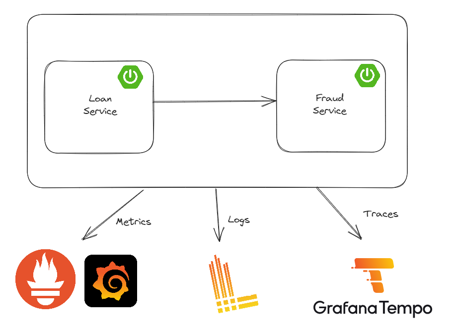

# Implementing Observability with Grafana Stack
For original source code visit [SaiUpadhyayula's GitHub Repository](https://github.com/SaiUpadhyayula/springboot3-observablity) 

> [!NOTE]
> This project was repurposed for the use of **Studio Galilei**'s Research and Development Division (Create G).
 
Last Modified (2024-08-07)


## Basic overview of tools used
- Grafana Loki: database for Logs (LOGQL)
- Prometheus: database for Metrics (PROMQL)
- Grafana Tempo: database for Traces (TRACEQL)
- Grafana: dashboard to view all the information


## Set Up
This set up is specific to **Maven** environment, for Gradle double-check the dependencies. For the container **Docker** is used
for production level Kubernetes is preferred.

### Dependencies
> [!IMPORTANT] 
> Add the following dependencies to the `pom.xml` file for each service.

**Loki dependency** 
```
<dependency>
    <groupId>com.github.loki4j</groupId>
    <artifactId>loki-logback-appender</artifactId>
    <version>1.5.2</version>
</dependency>
```
check this library for the most recent version: [Maven Repository](https://mvnrepository.com/artifact/com.github.loki4j/loki-logback-appender)

**Prometheus dependency**

*Micrometer Prometheus*
```
<dependency>
 <groupId>io.micrometer</groupId>
 <artifactId>micrometer-registry-prometheus</artifactId>
 <scope>runtime</scope>
</dependency>

```

*Spring Actuator: SpringBoot Actuator exposes operational information about the running application.*
```
<dependency>
 <groupId>org.springframework.boot</groupId>
 <artifactId>spring-boot-starter-actuator</artifactId>
</dependency>
```

**Tempo dependency**

*Micrometer Tracing*
```
<dependency>
 <groupId>io.micrometer</groupId>
 <artifactId>micrometer-tracing-bridge-brave</artifactId>
</dependency>

<dependency>
 <groupId>io.zipkin.reporter2</groupId>
 <artifactId>zipkin-reporter-brave</artifactId>
</dependency>
```
`micrometer-tracing-bridge-brave` automatically adds the traceID for the distributed tracing. `zipkin-reporter-brave`
exports the tracing information to tempo.
>[!NOTE]
> `Opentelemetry-micrometer-tracing-bridge-otel` can be used in place of the `zipkin-reporter-brave`

To trace calls to the database, add the following dependency
```
<dependency>
    <groupId>net.ttddyy.observation</groupId>
    <artifactId>datasource-micrometer-spring-boot</artifactId>
    <version>1.0.5</version>
</dependency>
```
check this library for the most recent version: [Maven Repository](https://mvnrepository.com/artifact/net.ttddyy.observation/datasource-micrometer-spring-boot)

Download the AOP dependency for ease of integration
```
<dependency>
 <groupId>org.springframework.boot</groupId>
 <artifactId>spring-boot-starter-aop</artifactId>
</dependency>
```

### LOKI set up

Firstly, create `logback-spring.xml` file inside the `src/main/resources`. This file will contain the necessary information 
about how to structure the logs and where to send them (contains information about LOKI URL).
```
<?xml version="1.0" encoding="UTF-8"?>
<configuration>
    <include resource="org/springframework/boot/logging/logback/base.xml"/>
    <springProperty scope="context" name="appName" source="spring.application.name"/>
 
    <appender name="LOKI" class="com.github.loki4j.logback.Loki4jAppender">
        <http>
            <url>http://localhost:3100/loki/api/v1/push</url>
        </http>
        <format>
            <label>
                <pattern>application=${appName},host=${HOSTNAME},level=%level</pattern>
            </label>
            <message>
                <pattern>${FILE_LOG_PATTERN}</pattern>
            </message>
            <sortByTime>true</sortByTime>
        </format>
    </appender>
 
    <root level="INFO">
        <appender-ref ref="LOKI"/>
    </root>
</configuration>
```
Secondly, create a `docker-compose.yaml` file located in the root directory of the two service. It should contain just
this line `services:`

Thirdly, add the following Loki configuration to `docker-compose.yaml` under `services:`
``` 
loki:
  image: grafana/loki:main
  command: [ "-config.file=/etc/loki/local-config.yaml" ] #Configuration file mapping
  ports:
    - "3100:3100"
```
Finally, this is the configuration file for Loki, this can exist on the local computer or in a Docker container. Make
sure in `docker-compose.yaml` Loki is correctly mapped to the location of the configuration file.

``` 
auth_enabled: false

server:
  http_listen_port: 3100

common:
  instance_addr: 127.0.0.1
  path_prefix: /loki
  storage:
    filesystem:
      chunks_directory: /loki/chunks
      rules_directory: /loki/rules
  replication_factor: 1
  ring:
    kvstore:
      store: inmemory

schema_config:
  configs:
    - from: 2020-10-24
      store: tsdb
      object_store: filesystem
      schema: v13
      index:
        prefix: index_
        period: 24h

ruler:
  alertmanager_url: http://localhost:9093

# By default, Loki will send anonymous, but uniquely-identifiable usage and configuration
# analytics to Grafana Labs. These statistics are sent to https://stats.grafana.org/
#
# Statistics help us better understand how Loki is used, and they show us performance
# levels for most users. This helps us prioritize features and documentation.
# For more information on what's sent, look at
# https://github.com/grafana/loki/blob/main/pkg/usagestats/stats.go
# Refer to the buildReport method to see what goes into a report.
#
# If you would like to disable reporting, uncomment the following lines:
#analytics:
#  reporting_enabled: false
```

## Running the project
To run the project, you need to have Docker and Docker Compose installed. Then, run the following command:

```docker compose up -d```

Run Loan Service Application

```cd loan-service```

```mvn spring-boot:run```

Run Fraud Detection Service Application

```cd fraud-detection-service```

```mvn spring-boot:run```


## Accessing the services
1. Grafana: http://localhost:3000
2. Prometheus: http://localhost:9090
3. Tempo: http://localhost:3110
4. Loki: http://localhost:3100

## Project Overview


